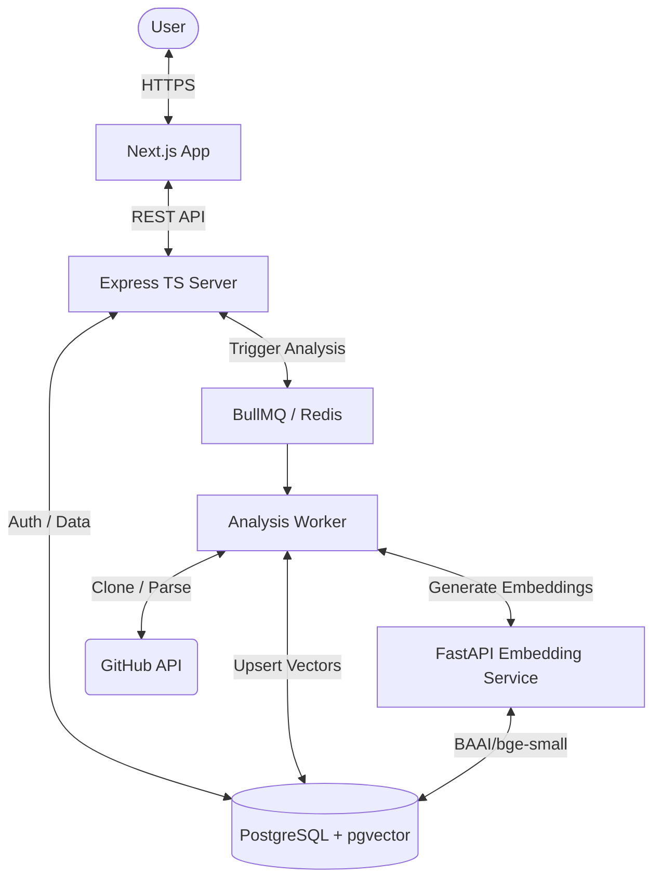

# 🛠️ RepoLens AI – Visualize. Parse. Chat.

[](https://nextjs.org/)
[](https://www.typescriptlang.org/)
[](https://fastapi.tiangolo.com/)
[](https://www.prisma.io/)
[](https://tailwindcss.com/)

**RepoLens AI** is an advanced repository analysis and visualization platform designed to help developers navigate complex codebases through interactive graphs and code-aware AI assistance. By combining **Tree-sitter** parsing with **Vector Search (RAG)**, it transforms static code into a living, searchable, and visual knowledge base.

---

## 🚀 Key Features

- **Interactive Code Visualization**: Explore your project's architecture through dynamic, interactive dependency graphs powered by **React Flow**.
- **Code-Aware AI Chat**: Ask questions about your codebase, find bugs, or understand complex logic using an LLM that knows your *entire* repository's context.
- **GitHub Native Integration**: Connect your repositories via the official GitHub App flow for secure, real-time access.
- **Deep Semantic Search**: Find code by meaning, not just keywords, using vector embeddings and PostgreSQL's `pgvector`.
- **Intelligent Parsing**: Multi-language support (Java, Python, Go) with granular structural analysis using **Tree-sitter**.

---

## 🏗️ Architecture & Flow

RepoLens utilizes a distributed architecture to handle CPU-intensive tasks like code parsing and embedding generation while maintaining a responsive user experience.

### System Architecture Diagram


### The RAG Pipeline
1. **Extraction**: Repository is cloned/fetched; code is split into logical blocks (functions, classes) using **Tree-sitter**.
2. **Embedding**: Blocks are sent to the **FastAPI Service** to generate high-dimensional vectors (384-dim).
3. **Indexing**: Vectors and metadata are stored in **PostgreSQL**.
4. **Retrieval**: User queries are embedded, and relevant code context is retrieved via similarity search.
5. **Generation**: Context is fed to **Gemini/OpenAI** to provide precise, code-backed answers.

---

## 📂 MVC Folder Structure

```text
RepoLens_AI/
├── frontend/             # Next.js Application (App Router)
│   ├── src/components/   # Reusable UI components (shadcn/ui)
│   ├── src/store/        # Zustand global state (auth, workspace)
│   └── src/app/          # Page routes & Layouts
├── backend/              # Node.js Express Server
│   ├── src/controllers/  # Request handlers (MVC: Controller)
│   ├── src/services/     # Business logic & LLM orchestration
│   ├── src/routes/       # API endpoint definitions
│   ├── src/middlewares/  # Authentication & Error handling
│   ├── src/database/     # Prisma client & DB interaction (MVC: Model)
│   └── prisma/           # Schema & Migrations
└── embedding-service/    # Python AI Service
    ├── main.py           # FastAPI server
    └── requirements.txt  # Python dependencies
```

---

## 📡 API Documentation

All routes are prefixed with `/api/v1`.

### Authentication
| Method | Endpoint | Description |
| :--- | :--- | :--- |
| `POST` | `/auth/register` | Register: `{"email", "password"}` |
| `POST` | `/auth/verify-otp` | Verify: `{"userId", "code"}` |
| `POST` | `/auth/login` | Login: `{"email", "password"}` (returns JWT) |

### Workspaces
| Method | Endpoint | Description |
| :--- | :--- | :--- |
| `GET` | `/workspaces` | List all workspaces |
| `POST` | `/workspaces` | Create: `{"name"}` |
| `GET` | `/workspaces/:id` | Get workspace details & members |

### Repositories & Analysis
| Method | Endpoint | Description |
| :--- | :--- | :--- |
| `POST` | `/workspaces/:id/repos/add` | Import Repo: `{"githubUrl"}` |
| `GET` | `/workspaces/:id/repos` | List analyzed repositories |
| `POST` | `/workspaces/:id/repos/:repoId/chat` | AI Chat: `{"message"}` |
| `GET` | `/analysis/status/:jobId` | Check ingestion/embedding progress |

---

## 🛠️ Setup & Installation

### Prerequisites
- **Node.js**: v20+
- **Python**: 3.10+
- **Database**: PostgreSQL 15+ with `pgvector` extension installed.
- **Tools**: `git`, `redis-server` (for analysis queue).

### 1. Vector Engine (Python)
The embedding service uses the `FlagEmbedding` library to generate 384-dimensional vectors.
```bash
cd embedding-service
python -m venv venv
# Windows
.\venv\Scripts\activate
# Linux/Mac
source venv/bin/activate
pip install -r requirements.txt
uvicorn main:app --port 8001 --workers 3
```

### 2. Backend Server (Express + Prisma)
```bash
cd backend
npm install
cp .env.example .env
# 1. Update DATABASE_URL with pgvector support
# 2. Add GEMINI_API_KEY for RAG
npx prisma migrate dev
npx prisma generate
npm run dev
```

### 3. Frontend App (Next.js)
```bash
cd frontend
npm install
npm run dev
```

---

## 🏗️ Technical Implementation Details

### Structural Parsing (Tree-sitter)
Unlike naive RAG systems that split files by character count, RepoLens uses **Abstract Syntax Trees (AST)**. It understands the difference between a `class`, a `method`, and a `variable declaration`, ensuring that the AI receives complete, logically-sound code segments.

### Intelligent Retrieval
Leveraging `pgvector` similarity search (`vector_cosine_ops`), we retrieve the top relevant code blocks based on the semantic intent of your question, not just keyword matches.

---


