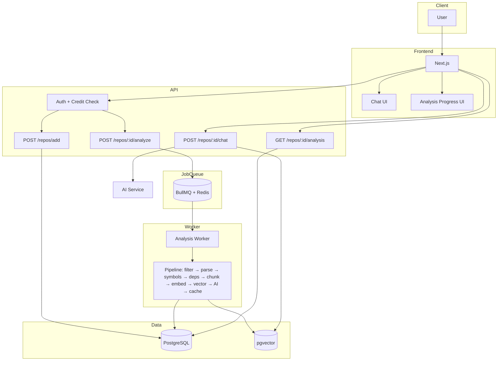
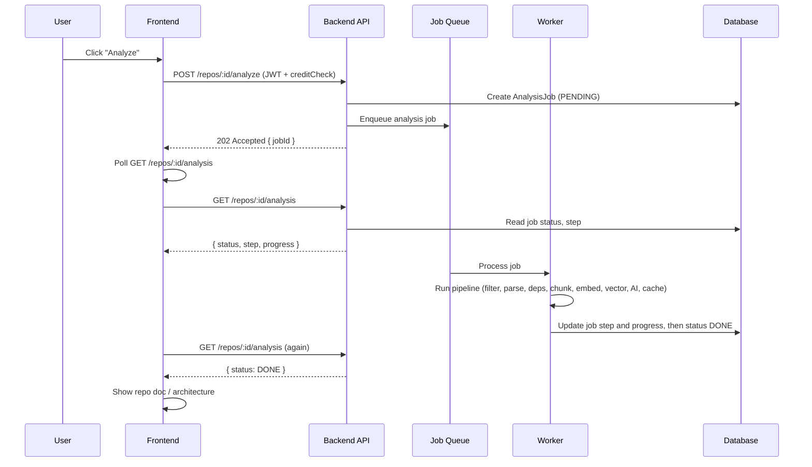
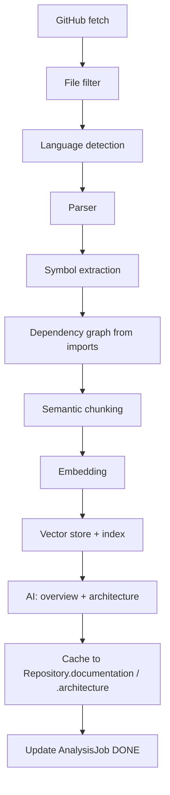
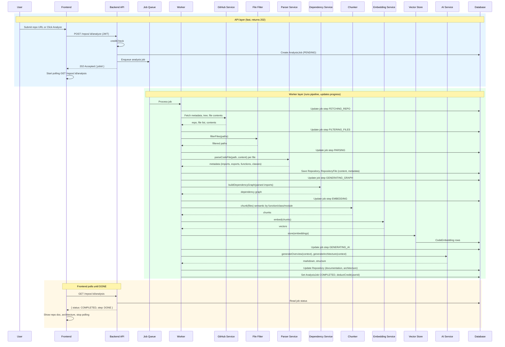

# RepoLens AI — Implementation Roadmap & Architecture (YC-Level SaaS)

**Purpose:** Single source of truth for what is built, what must change architecturally, and the industry-optimized path to production-grade AI SaaS.

---

## Table of Contents

1. [Executive Summary & Verdict](#1-executive-summary--verdict)
2. [What You Did Perfectly](#2-what-you-did-perfectly)
3. [What Needs Architectural Improvement](#3-what-needs-architectural-improvement)
4. [Industry-Optimized Approach (Detail)](#4-industry-optimized-approach-detail)
5. [Current State Overview](#5-current-state-overview)
6. [Target Architecture (Async Jobs + Pipeline)](#6-target-architecture-async-jobs--pipeline)
7. [Analysis Pipeline (Optimized)](#7-analysis-pipeline-optimized)
8. [Analysis Job & Progress Tracking](#8-analysis-job--progress-tracking)
9. [Module-by-Module Status & Improvements](#9-module-by-module-status--improvements)
10. [API Surface & Job Flow](#10-api-surface--job-flow)
11. [File Structure & New Files to Add](#11-file-structure--new-files-to-add)
12. [Recommended Implementation Order (Exact)](#12-recommended-implementation-order-exact)
13. [Security, Performance & Observability](#13-security-performance--observability)
14. [Deployment & Future SaaS](#14-deployment--future-saas)

---

**Copying diagrams:** Every visual has a **Copy** callout above it. Select the code block → `Ctrl+C` / `Cmd+C`. For **Excalidraw:** paste Mermaid into [Mermaid Live](https://mermaid.live) → **Actions → Export as PNG** → import image into [Excalidraw](https://excalidraw.com).

---

## 1. Executive Summary & Verdict

| Aspect | Status | Notes |
|--------|--------|--------|
| **Database (PostgreSQL + pgvector)** | ✅ | Industry standard (Supabase, Replit, Linear). Correct. |
| **Data model** | ✅ | User, Workspace, Repository, RepositoryFile, CodeEmbedding — exactly how code-AI products structure data. |
| **Service separation** | ✅ | github, parser, dependency, fileFilter, repository — proper modular design. |
| **Pipeline concept** | ✅ | filter → parse → dependency → chunk → embed → vector → AI is the correct RAG pipeline. |
| **Heavy work inside API request** | 🚨 | **Problem:** Full analysis runs in `POST /repos/add`. Large repos can take 30–120s. API must not run heavy jobs. |
| **Job queue / async analysis** | ❌ | **Required:** POST → create job → 202 Accepted → worker runs pipeline → frontend polls status. |
| **Symbol extraction & semantic chunking** | ⚠️ | Parser exists; add explicit symbol extraction and chunk by function/class/module for better RAG. |
| **Dependency graph** | ⚠️ | Build from parser imports (no madge, no clone). |
| **Parser** | ⚠️ | Babel for JS/TS is good; add Tree-sitter for Python/Go/Java (industry standard). |
| **Vector index** | ❌ | Must add pgvector index (e.g. ivfflat) or search will be slow. |
| **AI service & prompts** | ❌ | Dedicated `ai.service.ts` and `services/prompt/`; never put LLM calls in controllers. |
| **Caching AI results** | ❌ | Store `Repository.documentation` and `Repository.architecture`; re-analyze only when requested. |
| **Analysis progress UI** | ❌ | AnalysisJob table + steps (FETCHING_REPO → … → DONE); frontend shows progress. |

**Verdict:** Architecture is **8.5/10** today — very strong foundation. After the improvements in this doc: **9.5/10**, production-grade AI SaaS.

---

## 2. What You Did Perfectly

### ✅ Correct decisions

- **PostgreSQL + pgvector** — Industry standard for AI SaaS. Used by Supabase, Replit, Linear. Great choice.
- **Core entities** — User, Workspace, Repository, RepositoryFile, CodeEmbedding. This is exactly how most code-AI products structure data.
- **Separation of services** — github.service, parser.service, dependency.service, fileFilter, repository.service. Proper modular backend design; not monolithic controller logic.
- **Pipeline concept** — filter → parse → dependency → chunk → embed → vector search → AI is exactly how RAG pipelines are designed. You are on the correct path conceptually.
- **Frontend** — Chat panel, docs preview, files explorer, architecture graph, command palette. Right UX for an AI repo analysis tool. Only missing: real streaming AI, vector search integration, and analysis progress.

### ✅ What is already strong

- JWT auth, credits, workspace/repo CRUD, GitHub App integration, webhook.
- Babel for JS/TS parsing; regex fallback for other languages.
- File filter (ignore/include lists) implemented; needs wiring into pipeline.
- Prisma schema with CodeEmbedding (vector) ready for embeddings.

---

## 3. What Needs Architectural Improvement

### 🚨 1. Pipeline must not run inside the API request

**Current (dangerous):**

- `POST /repos/add` (or analyze) runs: fetch repo → fetch files → parse → dependency graph → chunk → embed → AI → save.
- Large repos can take **30s, 60s, 120s**.
- API requests must not run heavy jobs. This is how timeouts, memory spikes, and poor UX happen.

**Industry approach:**

- **POST /repos/add** → only save repo metadata (and optionally trigger a job).
- **POST /repos/:id/analyze** → create job → return **202 Accepted** with `jobId`.
- **Worker** (BullMQ + Redis) processes the repo asynchronously.
- **Frontend** polls `GET /repos/:id/analysis` or uses SSE for status and progress.

Used by: GitHub, Vercel, Sentry.

### 🚨 2. Add job queue and worker

- **BullMQ + Redis** for the job queue.
- Worker process (or same Node app with worker thread) runs the full analysis pipeline.
- API only: create job, return 202, and serve status/results.

### 🚨 3. Analysis progress tracking

- New table: **AnalysisJob** (id, repoId, status, progress, step, error?, createdAt, updatedAt).
- Steps: `FETCHING_REPO` → `FILTERING_FILES` → `PARSING` → `GENERATING_GRAPH` → `EMBEDDING` → `GENERATING_AI` → `DONE`.
- Frontend shows: “✔ Fetching files”, “✔ Parsing code”, “● Generating architecture”. Premium feel.

### ⚠️ 4. Other improvements (detailed in Section 4)

- Symbol extraction layer (classes, functions, exports, routes, controllers) for “Where is auth?”-style answers.
- Dependency graph from parser imports (no madge, no clone).
- Semantic chunking (by function/class/module), not fixed 300–500 token windows only.
- Tree-sitter for Python/Go/Java; keep Babel for JS/TS.
- pgvector index (ivfflat) for fast similarity search.
- AI service in `services/ai.service.ts`; prompts in `services/prompt/`.
- Cache AI outputs in `Repository.documentation` and `Repository.architecture`.

---

## 4. Industry-Optimized Approach (Detail)

### 4.1 Optimized pipeline (full sequence)

| Step | What to do | Why |
|------|------------|-----|
| 1. GitHub fetch | Fetch metadata, tree, file contents (filtered) | Same as now; add file filter before fetch. |
| 2. File filter | `filterFiles(paths)` — ignore node_modules, dist, .git, etc. | Reduce noise and cost. |
| 3. Language detection | Per-file language (you have `detectLanguage`) | Drives parser choice. |
| 4. Parser | AST parsing: Babel (JS/TS), Tree-sitter (Python, Go, Java) | Industry standard; used by GitHub, Neovim, Sourcegraph. |
| 5. **Symbol extraction** | Extract: classes, functions, exports, routes, controllers, services | Enables “Where is auth?”, “Where is DB connection?”. Cursor/Codeium do this. |
| 6. Dependency graph | Build from **parser imports** (file A imports B → edge A→B). No madge, no clone. | Saves disk I/O and time. |
| 7. Chunking | **Semantic:** split by function/class/module. Fallback 300–500 tokens. | RAG accuracy improves. |
| 8. Embedding | Batch embed chunks; write to CodeEmbedding. | Same as planned. |
| 9. Vector store | Store + **index** (ivfflat or hnsw). | Search stays fast at scale. |
| 10. AI generation | generateOverview(), generateArchitecture(); stream if needed. | In worker, not in controller. |
| 11. **Cache results** | Save to `Repository.documentation`, `Repository.architecture`. Re-run only on “Re-analyze”. | Saves LLM cost and latency. |

### 4.2 Parser: Babel + Tree-sitter

- **JS/TS** → Keep Babel (@babel/parser, @babel/traverse).
- **Python** → tree-sitter-python.
- **Go** → tree-sitter-go.
- **Java** → tree-sitter-java.

Tree-sitter is the industry standard (GitHub, Neovim, Sourcegraph). Use it for non-JS languages instead of regex only.

### 4.3 Dependency graph: from parser, not madge

- **Do not** rely on madge (requires clone + disk).
- After parsing all files: build `Map<filePath, string[]>` from each file’s **imports**.
- Resolve relative imports to repo paths. Graph = edges A→B when A imports B.
- Use this for architecture diagram and AI context. No clone, no disk I/O.

### 4.4 Chunking: semantic first

- Prefer **semantic boundaries**: one chunk per function, per class, or per module (with max token cap).
- Use parser/symbol extraction to get boundaries. Fallback: 300–500 token windows with overlap if needed.
- Improves RAG: “Where is auth?” returns whole `loginUser` function, not a random slice.

### 4.5 Vector search: add index

- Without an index, pgvector does full table scan. Fine for small data; slow at scale.
- Add index, e.g.:
  ```sql
  CREATE INDEX idx_code_embeddings_embedding
  ON "CodeEmbedding"
  USING ivfflat (embedding vector_cosine_ops)
  WITH (lists = 100);
  ```
- Tune `lists` by data size (e.g. 100–1000). Consider HNSW for lower latency if supported.

### 4.6 AI service design

- **Do not** put LLM calls inside controllers.
- Create **services/ai.service.ts** with:
  - `generateRepoOverview(context)`
  - `generateArchitecture(context)`
  - `explainFile(file, context)`
  - `chatWithRepo(messages, retrievedChunks)`
- Internally: `buildPrompt()` → `callLLM()` → `streamResponse()` (if streaming).
- Controllers only: call ai.service and return or stream.

### 4.7 Prompt builder

- Create **services/prompt/** (or prompts as modules):
  - `overview.prompt.ts`
  - `architecture.prompt.ts`
  - `chat.prompt.ts`
- `promptBuilder(repo, files, graph, userQuery)` returns `{ systemPrompt, userPrompt }`.
- Keeps prompts maintainable and testable.

### 4.8 Caching AI results

- Add (or use) fields: **Repository.documentation** (text), **Repository.architecture** (text or JSON).
- After AI generates overview/architecture, save to these fields.
- On repo detail load: serve cached doc; **re-analyze only when user clicks “Re-analyze”** or repo content changes (e.g. new commit). Saves LLM cost and improves perceived speed.

---

## 5. Current State Overview

### 5.1 Backend stack

| Layer | Tech | Status |
|-------|------|--------|
| Runtime | Node.js + Express 5 | ✅ |
| ORM | Prisma 7 | ✅ |
| Database | PostgreSQL + pgvector | ✅ |
| Auth | JWT, bcrypt, cookies | ✅ |
| Validation | Zod | ✅ |
| Security | Helmet, CORS, rate limit | ✅ |
| GitHub | @octokit/rest, @octokit/auth-app | ✅ |
| Parsing | Babel (JS/TS), regex (others) | ✅; add Tree-sitter for scale |
| Dependencies | madge | ✅; replace with graph-from-parser |
| Job queue | — | ❌ Add BullMQ + Redis |
| AI / Embeddings | — | ❌ |

### 5.2 Frontend stack

| Layer | Tech | Status |
|-------|------|--------|
| Framework | Next.js 16 (App Router) | ✅ |
| State | Zustand, TanStack Query | ✅ |
| UI | Tailwind, Radix, Framer Motion, cmdk | ✅ |
| Diagrams | React Flow, Recharts | ✅ |
| API Client | Custom fetch + refresh | ✅ |
| Missing | Real streaming AI, analysis progress | To add |

### 5.3 Database schema (current + required additions)

> **Copy diagram:** Select the code block below and copy (`Ctrl+C` / `Cmd+C`) to reuse.

```
┌─────────────┐     ┌──────────────────┐     ┌────────────┐
│    User     │────▶│  WorkspaceMember │◀────│ Workspace  │
│ (credits)   │     └──────────────────┘     └──────┬─────┘
└──────┬──────┘                                     │
       │  ┌─────────────────────┐                   │
       └─▶│ GitHubInstallation  │◀──────────────────┘
          └─────────────────────┘

┌──────────────┐     ┌─────────────────┐     ┌───────────────┐
│  Repository  │────▶│ RepositoryFile  │────▶│ CodeEmbedding │
│ (status)     │     │ (path, content) │     │ vector(1536)  │
│ +documentation│     │ +metadata?      │     │ + index       │
│ +architecture?│    └─────────────────┘     └───────────────┘
└──────┬───────┘
       │
       │  ┌──────────────┐
       └─▶│ AnalysisJob  │  NEW: id, repoId, status, step, progress, error?, createdAt, updatedAt
          └──────────────┘

       RefreshToken, Otp (auth)
```

- **Repository:** Add `documentation` (text), `architecture` (text/JSON) for cached AI output.
- **AnalysisJob:** id, repositoryId, status (PENDING|RUNNING|COMPLETED|FAILED), step (enum), progress (0–100 or step index), error (text?), createdAt, updatedAt.

---

## 6. Target Architecture (Async Jobs + Pipeline)

### 6.1 Correct high-level architecture

> **Copy diagram:** Select the code block below and copy (`Ctrl+C` / `Cmd+C`) to reuse.



**Layers (new approach):**

| Layer | Role |
|-------|------|
| **Frontend** | POST /analyze → get 202 → poll GET /analysis → show progress (✔/●) → show doc when DONE. |
| **API** | Auth, creditCheck, create AnalysisJob, enqueue job, return 202. Serve GET /analysis. No heavy pipeline. |
| **Job Queue (BullMQ + Redis)** | Hold jobs; pass to Worker. |
| **Worker** | Run full pipeline (fetch → filter → parse → graph → chunk → embed → vector → AI → cache); update AnalysisJob.step; set DONE, deductCredit. |
| **Data** | PostgreSQL (Repository, RepositoryFile, CodeEmbedding, AnalysisJob), pgvector with index. |

### 6.2 Request flow: analyze (202 + poll)

> **Copy diagram:** Select the code block below and copy (`Ctrl+C` / `Cmd+C`) to reuse.



---

## 7. Analysis Pipeline (Optimized)

### 7.1 Full pipeline (worker steps)

> **Copy diagram:** Select the code block below and copy (`Ctrl+C` / `Cmd+C`) to reuse.



### 7.2 Step details

| Step | Update AnalysisJob.step | Action |
|------|--------------------------|--------|
| 1 | FETCHING_REPO | Fetch metadata + tree + file contents (after filter). |
| 2 | FILTERING_FILES | filterFiles(paths). |
| 3 | PARSING | parseCodeFile per file; optional: store metadata on RepositoryFile. |
| 4 | GENERATING_GRAPH | Build dependency graph from imports (no madge). |
| 5 | EMBEDDING | Chunk → embed → write CodeEmbedding. |
| 6 | GENERATING_AI | generateRepoOverview(), generateArchitecture(); stream or wait. |
| 7 | DONE | Save documentation, architecture; set job status COMPLETED; deductCredit. |

### 7.3 In-depth pipeline sequence (new approach: API layer + Worker layer)

This diagram reflects the **new architecture**: the **API** only does auth, credit check, create job, enqueue, and return 202. The **Worker** (triggered by the job queue) runs the full pipeline and updates progress. No heavy work in the API request.

> **Copy diagram:** Select the code block below and copy (`Ctrl+C` / `Cmd+C`) to reuse in [Mermaid Live](https://mermaid.live) or Excalidraw (export as PNG).



**Layers:**

| Layer | Responsibility |
|-------|----------------|
| **API** | Authenticate, creditCheck, create AnalysisJob, enqueue to BullMQ, return 202. Serve GET /analysis (read job from DB). Never run GitHub fetch, parse, embed, or AI. |
| **Job Queue** | Hold pending jobs; hand off to Worker. |
| **Worker** | Run full pipeline: fetch → filter → parse → graph → chunk → embed → vector store → AI → cache; update AnalysisJob.step after each stage; set DONE and deductCredit at end. |
| **Frontend** | POST analyze → receive 202 → poll GET /analysis until status COMPLETED or FAILED → show progress (e.g. ✔ Fetching, ● Parsing) then show doc/architecture. |

**Notes:**

- **Dependency graph:** Built from parser imports (no madge, no clone). Resolve imports to file paths; edges A→B when A imports B.
- **Chunking:** Semantic (function/class/module) with token limit; fallback 300–500 tokens.
- **Cache:** Worker writes `Repository.documentation` and `Repository.architecture` so the next load does not re-call the LLM.
- **Progress:** Worker updates `AnalysisJob.step` (and optionally `progress`) at each stage so the frontend can show “✔ Fetching repo”, “✔ Parsing code”, “● Generating architecture”, etc.


### 7.4 Sync pipeline sequence (single request, monochrome style)

Same flow as the sync/legacy approach: API runs the full pipeline in one request. Use **dark theme** in [Mermaid Live](https://mermaid.live) (Actions → Theme → Dark) for the light-on-dark monochrome look. One color band wraps the whole sequence.

> **Copy diagram:** Select the code block below. In Mermaid Live choose **Theme → Dark** for the look in your reference image.

```mermaid
sequenceDiagram
  participant U as User
  participant FE as Frontend
  participant API as Backend API
  participant GH as GitHub Service
  participant FLT as File Filter
  participant Parser as Parser Service
  participant Dep as Dependency Service
  participant Chunk as Chunker
  participant Emb as Embedding Service
  participant Vec as Vector Store
  participant AI as AI Service
  participant DB as Database

  rect rgb(45, 48, 55)
    U->>FE: Submit repo URL
    FE->>API: POST /analyze (JWT)
    API->>API: creditCheck
    API->>GH: Fetch metadata + tree + contents
    GH-->>API: repo + file list + contents
    API->>FLT: filterFiles(paths)
    FLT-->>API: filtered paths
    API->>Parser: parseCodeFile(path, content) per file
    Parser-->>API: metadata (imports, exports, functions, classes)
    API->>DB: Save Repository + RepositoryFile (content, metadata)
    API->>Dep: generateDependencyGraph from in-memory graph
    Dep-->>API: dependency graph
    API->>DB: Save graph or pass to AI
    API->>Chunk: chunk(files)
    Chunk-->>API: chunks
    API->>Emb: embed(chunks)
    Emb-->>API: vectors
    API->>Vec: store(embeddings)
    Vec->>DB: CodeEmbedding rows
    API->>AI: generateOverview, generateArchitecture
    AI-->>API: markdown, structure
    API->>DB: Update repo status, doc cache
    API->>API: deductCredit(userId)
    API-->>FE: 201 + repo data
  end
```



---

## 8. Analysis Job & Progress Tracking

### 8.1 AnalysisJob model (Prisma)

Add to schema:

```prisma
model AnalysisJob {
  id           String   @id @default(cuid())
  repositoryId String   @unique  // one active job per repo; or allow queue
  status       AnalysisJobStatus @default(PENDING)
  step         AnalysisJobStep?
  progress     Int      @default(0)  // 0-100 or step index
  error        String?  @db.Text
  createdAt    DateTime @default(now())
  updatedAt    DateTime @updatedAt

  repository   Repository @relation(fields: [repositoryId], references: [id], onDelete: Cascade)

  @@map("analysis_jobs")
}

enum AnalysisJobStatus {
  PENDING
  RUNNING
  COMPLETED
  FAILED
}

enum AnalysisJobStep {
  FETCHING_REPO
  FILTERING_FILES
  PARSING
  GENERATING_GRAPH
  EMBEDDING
  GENERATING_AI
  DONE
}
```

### 8.2 Frontend progress UI

- Poll `GET /workspaces/:workspaceId/repos/:repoId/analysis` (or `/repos/:id/analysis`) every 1–2s while status is RUNNING.
- Display:
  - ✔ Fetching repo
  - ✔ Filtering files
  - ✔ Parsing code
  - ● Generating architecture (current step)
  - etc.
- On COMPLETED: show docs/architecture; stop polling.
- On FAILED: show error message.

---

## 9. Module-by-Module Status & Improvements

### Module 1 — Database Layer

| Responsibility | Status | Improvement |
|----------------|--------|-------------|
| Users, repos, files | ✅ | — |
| CodeEmbedding | ✅ Schema | Add ivfflat (or hnsw) index. |
| Cached AI output | ❌ | Add Repository.documentation, Repository.architecture. |
| AnalysisJob | ❌ | Add model + enums as above. |

### Module 2 — Authentication

| Feature | Status | Note |
|---------|--------|------|
| JWT, creditCheck | ✅ | Apply creditCheck to **POST /repos/:id/analyze**; deduct credit in worker when job completes. |

### Module 3 — GitHub Service

| Responsibility | Status | Note |
|----------------|--------|------|
| Fetch metadata, tree, contents | ✅ | Apply file filter to paths before fetching contents. |

### Module 4 — File Filter

| Responsibility | Status | Note |
|----------------|--------|------|
| filterFiles | ✅ | Wire into pipeline (after tree, before fetch content). |

### Module 5 — Parser

| Responsibility | Status | Improvement |
|----------------|--------|-------------|
| Babel (JS/TS) | ✅ | Keep. |
| Regex (others) | ✅ | Add Tree-sitter for Python, Go, Java. |
| Symbol extraction | ⚠️ | Make explicit: classes, functions, exports, routes, controllers. Store or pass to chunker/AI. |

### Module 6 — Dependency Graph

| Responsibility | Status | Improvement |
|----------------|--------|-------------|
| Graph | ✅ madge | **Prefer:** Build from parser imports (no clone, no madge). Map<filePath, imports[]> → edges. |

### Module 7 — Chunker

| Responsibility | Status | Improvement |
|----------------|--------|-------------|
| Chunking | ❌ | **Semantic:** by function/class/module; max tokens per chunk. Fallback: 300–500 token windows. |

### Module 8 — Embedding

| Responsibility | Status | Note |
|----------------|--------|------|
| Embed + store | ❌ | Batch embed; write to CodeEmbedding. In worker. |

### Module 9 — Vector Store

| Responsibility | Status | Improvement |
|----------------|--------|-------------|
| Search | ❌ | Implement search(repositoryId, queryEmbedding, topK). **Add index** (ivfflat/hnsw). |

### Module 10 — AI Service

| Responsibility | Status | Improvement |
|----------------|--------|-------------|
| generateOverview, generateArchitecture, explainFile, chatWithRepo | ❌ | In **services/ai.service.ts**; never in controllers. |

### Module 11 — Prompt Builder

| Responsibility | Status | Improvement |
|----------------|--------|-------------|
| Build system/user prompts | ❌ | **services/prompt/** (overview, architecture, chat). promptBuilder(repo, files, graph, query). |

### Module 12 — RAG Chat

| Step | Status | Note |
|------|--------|------|
| Embed query → vector search → prompt → LLM → stream | ❌ | New endpoint POST /repos/:id/chat; frontend already has chat UI. |

### Module 13 — Repository Analysis Pipeline

| Step | Current | Target |
|------|---------|--------|
| Trigger | Sync in POST add | **POST /repos/:id/analyze** → 202 → worker |
| Fetch | ✅ | ✅ |
| Filter | ❌ | ✅ |
| Parse | ❌ | ✅ + symbol extraction |
| Dependency | madge/clone | From parser imports |
| Chunk | ❌ | ✅ Semantic |
| Embed + store | ❌ | ✅ + index |
| AI | ❌ | ✅ + cache |
| Progress | ❌ | ✅ AnalysisJob steps |

### Module 14 — Credit System

| Item | Status | Note |
|------|--------|------|
| creditCheck on analyze | ✅ middleware | Attach to analyze route. |
| deductCredit | ✅ | Call in worker when job COMPLETED. |

### Module 15 — API Endpoints

| API | Current | Target |
|-----|---------|--------|
| POST /repos/add | ✅ | Save repo only (optional: enqueue job). |
| POST /repos/:id/analyze | ❌ | Create job, enqueue, return 202 { jobId }. |
| GET /repos/:id/analysis | ❌ | Return job status, step, progress. |
| POST /repos/:id/chat | ❌ | RAG chat (embed → search → LLM → stream). |

---

## 10. API Surface & Job Flow

Base path: `/api/v1`.

| Method | Path | Auth | Purpose |
|--------|------|------|---------|
| POST | /auth/register, /auth/login | No | Register, login |
| POST | /auth/refresh | Cookie | Refresh access token |
| GET | /auth/me | Yes | Current user + credits |
| GET | /workspaces/:workspaceId/repos | Yes | List repos |
| POST | /workspaces/:workspaceId/repos/add | Yes | Add repo (save metadata; optionally enqueue analyze) |
| GET | /workspaces/:workspaceId/repos/:repoId | Yes | Repo detail + files + cached doc/architecture |
| POST | /workspaces/:workspaceId/repos/:repoId/analyze | Yes | **Create analysis job → 202 Accepted { jobId }** |
| GET | /workspaces/:workspaceId/repos/:repoId/analysis | Yes | **Job status, step, progress** |
| POST | /workspaces/:workspaceId/repos/:repoId/chat | Yes | RAG chat (stream) |
| DELETE | /workspaces/:workspaceId/repos/:repoId | Yes | Delete repo |
| GitHub install/list/webhook | Yes | As today |

---

## 11. File Structure & New Files to Add

### 11.1 Backend (additions)

```
backend/src/
├── services/
│   ├── ai.service.ts           # generateRepoOverview, generateArchitecture, explainFile, chatWithRepo
│   ├── embedding.service.ts    # embed(chunks) → vectors
│   ├── vectorStore.service.ts  # search(repositoryId, queryEmbedding, topK)
│   ├── chunker.service.ts      # semantic chunking (function/class/module)
│   └── prompt/
│       ├── overview.prompt.ts
│       ├── architecture.prompt.ts
│       └── chat.prompt.ts
├── workers/
│   └── analysis.worker.ts      # BullMQ job: run full pipeline, update AnalysisJob
├── queues/
│   └── analysis.queue.ts      # BullMQ queue definition
└── jobs/
    └── analysis.job.ts         # create job, enqueue, return 202
```

### 11.2 Database migration

- Add **AnalysisJob** model + enums.
- Add **Repository.documentation**, **Repository.architecture** (if not present).
- Add **pgvector index** on CodeEmbedding(embedding).

---

## 12. Recommended Implementation Order (Exact)

Do in this order so each step is testable and the architecture stays correct.

1. **Add job queue (BullMQ + Redis)**  
   - Create queue, worker stub, and **POST /repos/:id/analyze** that creates AnalysisJob, enqueues job, returns 202.  
   - Worker: for now only update job steps (mock pipeline).  
   - Frontend: poll GET /repos/:id/analysis and show status/step.

2. **Implement chunker**  
   - Semantic chunking using parser/symbol output; fallback 300–500 tokens.  
   - Input: list of files with content + metadata. Output: chunks with fileId, startLine, endLine.

3. **Add embedding service**  
   - Call OpenAI (or chosen provider) for embeddings; batch; write to CodeEmbedding.  
   - Run in worker after chunker.

4. **Add vector search + index**  
   - Implement vectorStore.service search.  
   - Add ivfflat (or hnsw) index on CodeEmbedding.embedding.

5. **Create AI service + prompt builder**  
   - services/ai.service.ts: generateRepoOverview(), generateArchitecture().  
   - services/prompt/: overview, architecture.  
   - Worker calls AI service; writes to Repository.documentation, .architecture.

6. **Add RAG chat**  
   - POST /repos/:id/chat: embed query → vector search → build prompt → LLM → stream.  
   - Connect frontend chat UI to this endpoint.

7. **Add analysis progress UI**  
   - Ensure AnalysisJob steps are updated in worker at each pipeline stage.  
   - Frontend: “✔ Fetching files”, “✔ Parsing code”, “● Generating architecture”, etc.

8. **Wire file filter + parser + dependency-from-imports**  
   - In worker: after fetch, filter paths; parse each file; build graph from imports; then chunk → embed → AI.  
   - Add symbol extraction to parser output where needed.

9. **Credit check + deduct**  
   - creditCheck on POST /repos/:id/analyze.  
   - deductCredit in worker when job COMPLETED.

10. **Caching**  
    - Serve Repository.documentation and .architecture on repo detail; re-run analysis only when user requests or (later) on new commit.

11. **Optional: Tree-sitter**  
    - Add Tree-sitter for Python, Go, Java for better parsing at scale.

12. **Logging & monitoring**  
    - Pino, Sentry, optional OpenTelemetry.

---

## 13. Security, Performance & Observability

| Area | Current | Recommendation |
|------|---------|----------------|
| Rate limiting | ✅ | Keep; consider per-route for /analyze, /chat. |
| JWT | ✅ | Keep short-lived access token. |
| Input validation | ✅ Zod | Add schemas for analyze, chat bodies. |
| CORS / Helmet | ✅ | Keep. |
| Repo caching | ❌ | Use Repository.documentation, .architecture. |
| Embedding index | ❌ | **Must:** ivfflat/hnsw on CodeEmbedding. |
| Background jobs | ❌ | **Must:** BullMQ + Redis; 202 + poll. |
| Logging | console | Pino, structured. |
| Errors | — | Sentry (or similar). |
| Tracing | — | Optional: OpenTelemetry later. |

---

## 14. Deployment & Future SaaS

| Component | Suggestion |
|-----------|------------|
| Frontend | Vercel |
| Backend API | Render / DigitalOcean / Railway |
| Worker | Same platform (Node process) or separate worker dyno/container |
| Redis | Upstash / Redis Cloud / same provider |
| Database | Supabase / Neon (PostgreSQL + pgvector) |
| AI | Groq / OpenAI for LLM + embeddings |
| Future | Teams, private repos, Stripe, API keys, analytics |

---

**Summary:** Your foundation is strong (8.5/10). The critical change is **moving the full analysis pipeline off the API request and into a job queue + worker**, with **analysis progress** and **cached AI results**. Then add semantic chunking, graph-from-imports, vector index, dedicated AI service and prompt modules, and RAG chat. In that order you reach a production-grade, YC-level AI SaaS (9.5/10).

*Document updated for RepoLens AI. Revise as you implement.*
